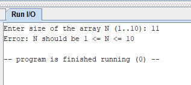

# ИДЗ №1

**Тимошкин Александр Игоревич, БПИ248** 

## Вариант 38

Сформировать массив B из элементов массива A, которые одновременно имеют четные и отрицательные значения

## Тестовые запуски программы

### При некорректных N

### При корректных N

## Выполненные требования

## Выполненные требования

### Базовые (4–5 баллов)

- Реализован **ввод исходных данных с клавиатуры** (через подпрограммы `READ_INT`, `READ_ARR`).
- Реализован **вывод исходного и результирующего массива** на консоль с поясняющими надписями (`PRINT_STR`, `PRINT_ARR`).
- Программа снабжена **комментариями**, описывающими выполняемые действия и структуру стека.
- При **вводе некорректного N** (например, ≤ 0 или слишком большого) программа **завершает работу с сообщением об ошибке**, без повторного запроса.

---

### Использование стека (6–7 баллов)

- Подпрограмма `form_arrayB` принимает **все параметры через стек**:
  - `12(sp_old)` — количество элементов `N`,
  - `8(sp_old)` — адрес массива `A`,
  - `4(sp_old)` — адрес массива `B`.
- Внутри подпрограммы используются **локальные переменные**, размещаемые в стеке (смещения подписаны в комментариях).
- Возврат результата (новое количество элементов массива `B`) осуществляется **также через стек**, по адресу `0(sp_old)`.
- При вызове подпрограммы (в `main.asm`) даны **комментарии**, поясняющие соответствие фактических и формальных параметров.

---

### Модульность и тестирующая программа (8 баллов)

- Подпрограмма `form_arrayB` реализована **универсально** — поддерживает многократное использование с разными исходными данными.
- Создан **отдельный тестовый модуль** `test.asm`, автоматически выполняющий **несколько тестов** (в том числе случай с `k = 0`).
- В тестах для удобства визуального анализа выполняется вывод длины массивов и перехода на новую строку (`\n`) между тестами.
- Программа разбита на **несколько ассемблерных модулей**:
  - `macros.asm` — библиотека макросов (ввод, вывод, вызов `form_arrayB`);
  - `io.asm` — подпрограммы ввода и вывода;
  - `array_ops.asm` — модуль обработки массива (логика отбора отрицательных чётных);
  - `test.asm` / `main.asm` — тестовая и основная программы соответственно.

---

### Макросы в отдельной библиотеке (9 баллов)

- Макросы собраны в **автономный файл `macros.asm`**, обеспечивающий многократное использование:
  - `READ_ARR`, `PRINT_ARR` — ввод/вывод массивов;
  - `FORM_ARR` — вызов подпрограммы обработки массива с передачей параметров через стек и приёмом результата.
- Макросы снабжены комментариями, описывающими назначение и передачу параметров.
- Библиотека макросов используется **в обеих программах** (основной и тестирующей), что подтверждает **унификацию и модульность** решения.

